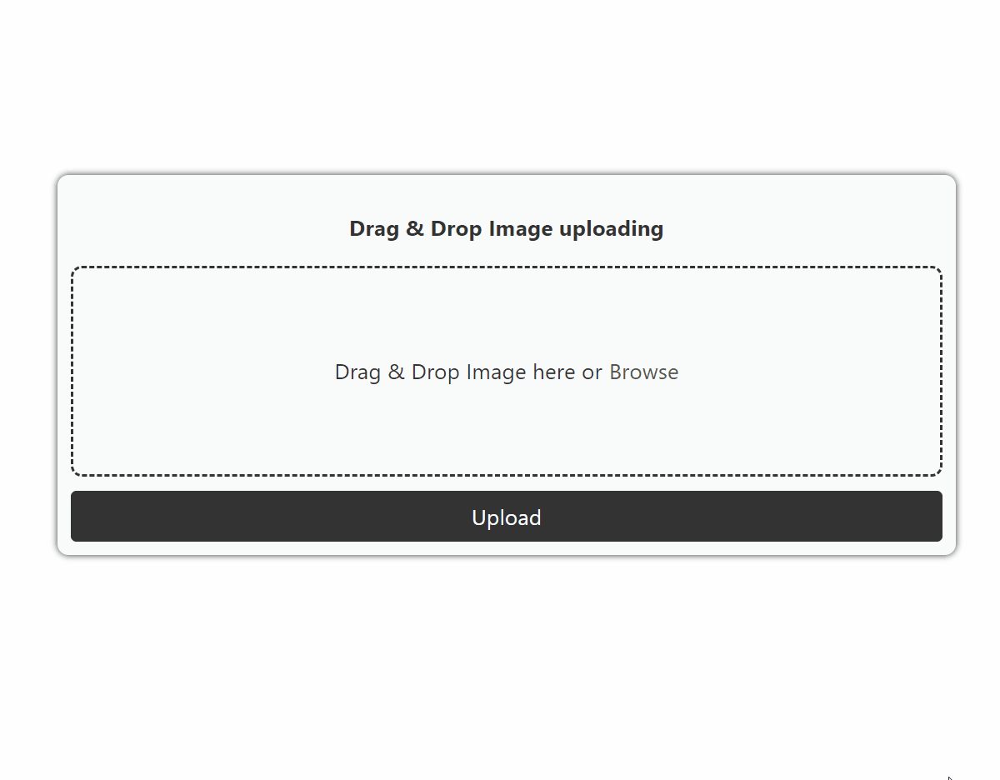

# ReactDotNetToolkit

Created with Create React App .net

## Launch front-end + back-end
> cd ReactDotNetToolkit.Server

> dotnet run

> https://localhost:5117

# Features

[Drag and Drop Image Uploader + Back-end](reactdotnettoolkit.client/src/Components/Images/DragAndDropImageUploader/README.md)

